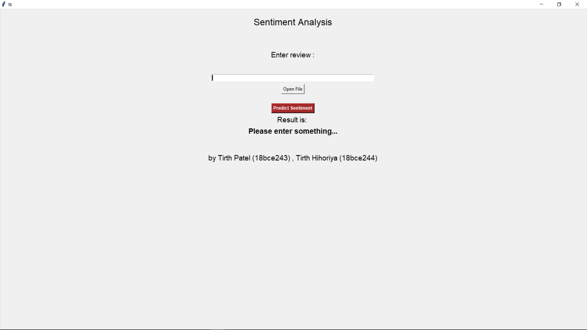
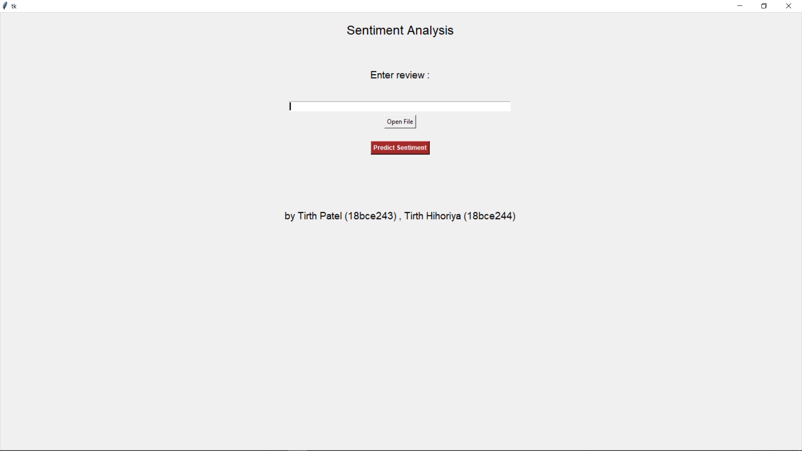
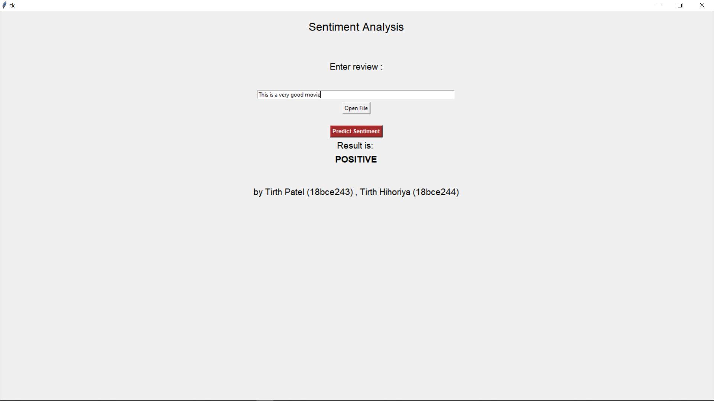
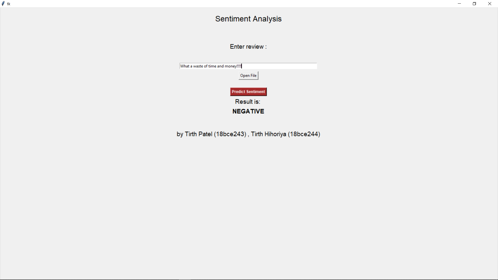
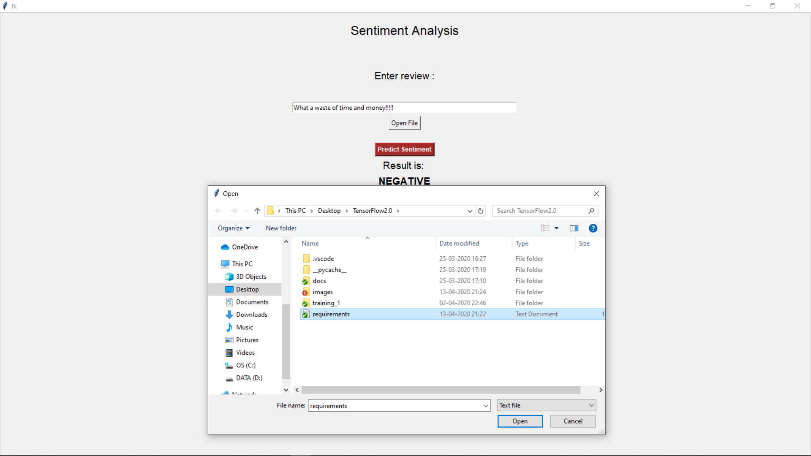

# TensorFlow2.0-Models

Semester 4 PSC Project: Creating and Exporting TensorFlow2.0 Models for Sentiment Analysis

## Sentiment Analysis Model

We have created a bidirectional LSTM model for sentiment analysis on IMDB dataset of 8000 words. This achieves an accuracy of about 95\% on training set and 86\% on test set. **The training notebook can be found [here](TensorFlow_2_0_Sentiment_Analysis.ipynb).** You can run a GUI based app locally by running ``python gui.py``. This will automatically load all the required models and you are ready to predict the results!!
### Explanatory video can be found [here](explanatory_video.mp4)


## Usage

#### Linux

```shell
git clone https://github.com/tirthasheshpatel/TensorFlow2.0-Models.git
cd TensorFlow2.0-Models
python3 -m venv env
source env/bin/activate
pip install --upgrade pip
pip install -r requirements.txt
python gui.py
```

#### Windows

```bash
git clone https://github.com/tirthasheshpatel/TensorFlow2.0-Models.git
cd TensorFlow2.0-Models
python -m venv env
.\env\Scripts\activate
pip install --upgrade pip
pip install -r requirements.txt
python gui.py
```

### Frameworks Used

1. Tensorflow
2. Tkinter
3. Tensorflow Hub
4. Keras
5. Tensorflow Datasets

### GUI










